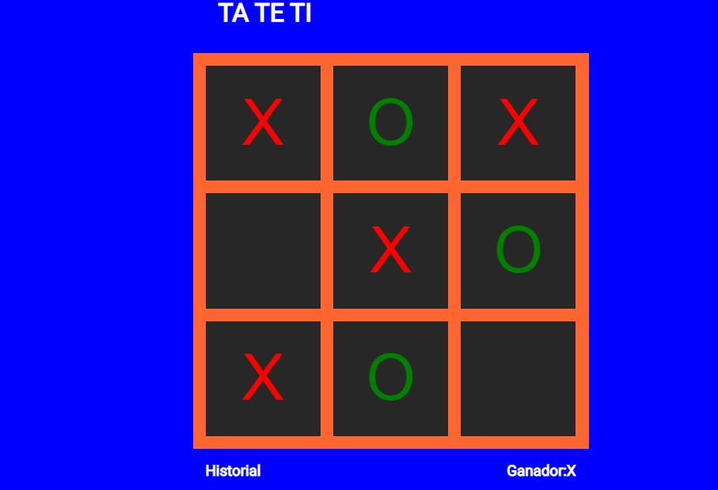

<h6>Juego de TA TE TI hecho con React Js</h6>
El juego tiene tres componentes:
<ul>
<li>Square : renderiza un boton.</li>
  <li>Board : cuenta con nueve cuadrados.</li>
  <li>Game : renderiza una tabla con valores de posicion fija luego modificados.</li>
</ul>

Los cuadrados del tablero cuentan con una propiedad{value} para la 'X' , la 'O' o null si esta vacio  y una onClick ,para que sea llamada el evento cuando se hace click.

Resumen a completar
